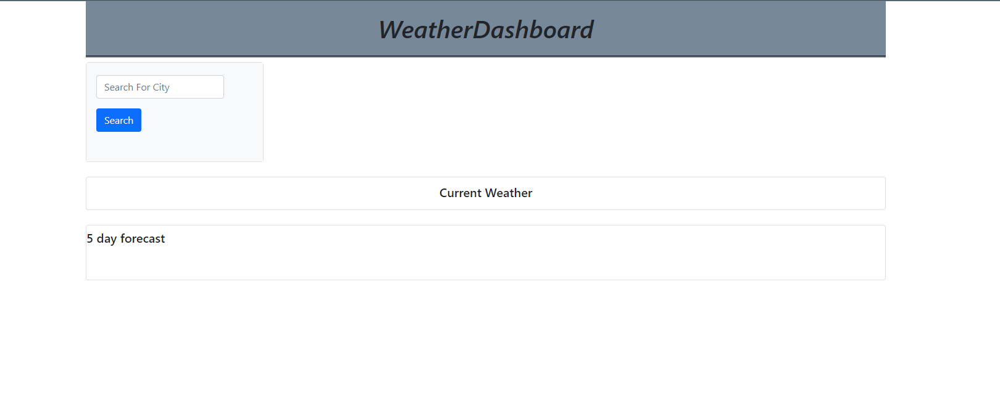
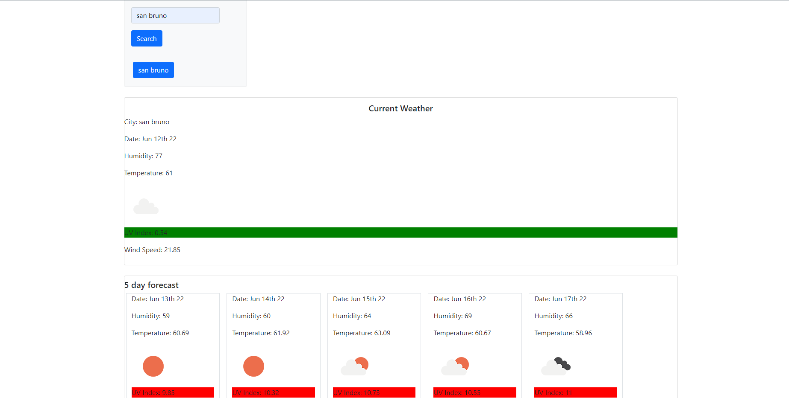
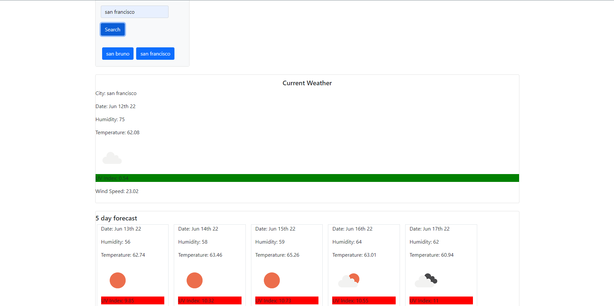
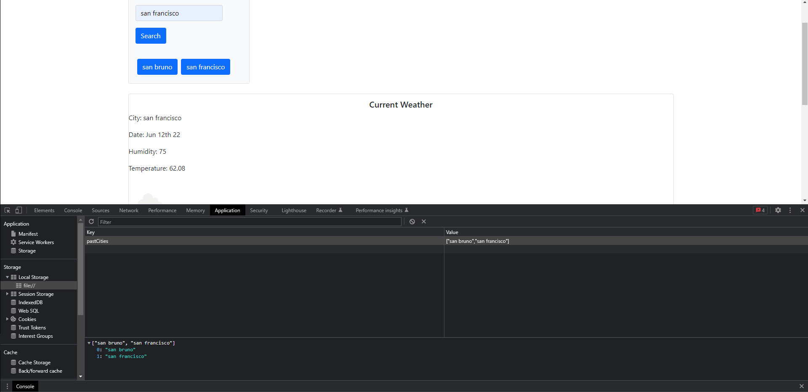

# Weather-Dashboard
#
## Deployed Link: https://tellez215.github.io/Weather-Dashboard/

## Badges :

## Description
A simple web application that allows users to search for a city to get the current weather and 5 day forecast. Cities that users previously looked up will be saved in their local storage.

## Usage
- Users will be able to search for a city to get the current weather and 5 day forecast.
- The search history of the user will also be saved to local storage and remain on page
- The city name will be displayed and users will be provided with the date, icons representing the weather, the temperature, humidity, wind speed, and the UV Index.
## Visuals 

 How the page first looks.

 How the page looks when users type and search for a city.

 Past cities are saved to local storage and still being presented on the screen for users.

 How the local storage looks like when users cities are being saved.

## License
[MIT](./license.md)